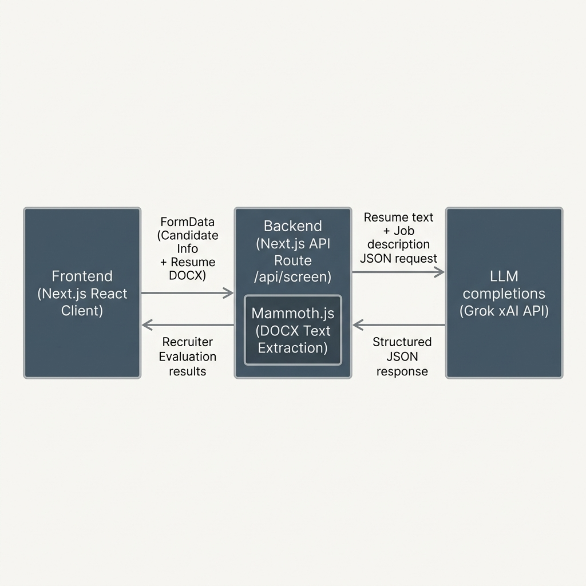

# Interview Screener — Technical Overview & Design Brief

Interview Screener is a professional recruiter-focused tool built to simplify candidate evaluations. The application allows recruiters to enter candidate demographics, upload a `.docx` resume, select a target job description, review the collected inputs, and perform a highly targeted, structured LLM evaluation that maps candidate experience directly against role requirements.

## Product Write-up
Recruiting pipelines are often flooded with resumes, leading to screening fatigue and biased or inconsistent decisions. Interview Screener addresses this by acting as a "glass lens" for recruiters—providing an objective, structured, and evidence-supported comparison of a candidate's resume against a specific job role. It avoids glowing AI summaries and instead produces concrete evaluations based on actual resume evidence. The visual design is calm, functional, and devoid of "AI fluff" (like neon gradients, glowing cards, or chatbot windows), adopting an editorial dashboard style that puts information density and clarity first.

---

## Tech Stack & Architecture

- **Core Framework:** Next.js (App Router)
- **Language:** TypeScript
- **Styling:** Tailwind CSS (v4)
- **DOCX Parser:** Mammoth.js (Vercel serverless-safe, zero native binary dependencies)
- **LLM API:** Grok xAI API (OpenAI-compatible) or simulated mock fallback when offline or key-less

---

## How It Works



### 1. DOCX Parsing
Resumes are uploaded as `.docx` files. Upon screening submission:
- The file is sent as a `multipart/form-data` request to the `/api/screen` API endpoint.
- Server-side, `mammoth` extracts the raw text from the file buffer without requiring temp directories or complex system-level dependencies.
- The extracted text is normalized and cleaned before being bundled into the LLM context.

### 2. LLM Screening Logic
The server makes a secure call to the xAI/Grok completions API (`https://api.x.ai/v1/chat/completions`) using the candidate resume, the full selected job opening description, and relevant candidate parameters. 
- The system prompt enforces strict rules: **no age, gender, location, race, or other protected characteristics are allowed to impact candidate scoring or fit evaluation**.
- The model outputs a structured JSON object detailing:
  - `match_score` (0–100) based on role alignment evidence.
  - `overall_fit` (2–4 concise sentences).
  - `strong_matches` (3–5 bullet points citing concrete resume evidence).
  - `gaps_and_questions` (list of gaps and recruiter questions to ask).
- If the API key is not configured, or if the API request fails, the route gracefully falls back to a high-quality simulated mock result labeled as **"Simulated Mode"** in the UI to ensure the recruitment workflow remains fully operational.

---

## Setup & Running Locally

### 1. Prerequisites
- Node.js (v18+)
- npm / pnpm / yarn

### 2. Install Dependencies
```bash
npm install
```

### 3. Configure Environment Variables
Create a `.env.local` file in the root directory:
```env
LLM_API_KEY=your_grok_api_key_here
```

### 4. Run Development Server
```bash
npm run dev
```
Open [http://localhost:3000](http://localhost:3000) in your browser.

### 5. Build for Production
```bash
npm run build
npm run start
```

---

## Vercel Deployment

This project is optimized for instant, zero-configuration deployment to **Vercel**:
1. Connect your repository to Vercel.
2. Under **Environment Variables**, add:
   - `LLM_API_KEY`: Your xAI/Grok API key.
3. Click **Deploy**.

---

## Trade-offs & Future Improvements

### Trade-offs Made
- **No Database:** To align with the take-home guidelines and keep the tool lightweight, all candidate evaluation state is maintained in the React component lifecycle. This makes deployment straightforward but does not persist candidate histories.
- **Serverless Parsing:** Using `mammoth` for DOCX parsing runs within serverless execution limits, avoiding long-running container costs but limiting support to `.docx` documents.

### What to Improve with More Time
- **Resume Persistence:** Integrate a secure database (e.g., Supabase / PostgreSQL) to save candidate profiles, matching scores, and resume files, providing an archive/dashboard for the recruiting team.
- **Multipart PDF Parsing:** Add a serverless PDF text extractor (e.g., `pdf-parse`) to allow resume uploads in PDF format alongside `.docx`.
- **Comparative Search & Filtering:** Create a candidate table dashboard showing all processed candidates sorted by match scores and tags.
